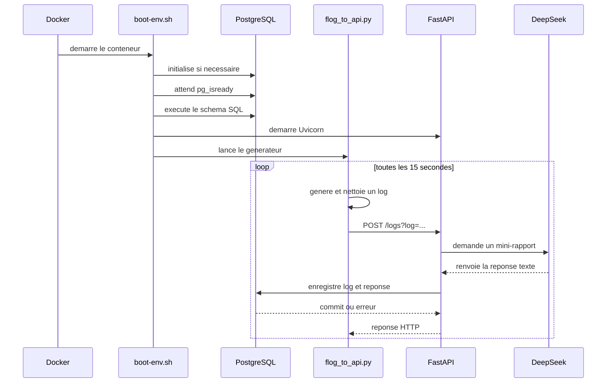

# API de collecte et d'analyse de logs

## Vue d'ensemble

Ce projet collecte des logs generes par `flog`, les envoie a une API FastAPI, demande un mini-rapport a l'API DeepSeek, puis enregistre le log et la reponse de l'IA dans PostgreSQL.

Le flux principal est :

```text
flog -> script Python -> API FastAPI -> API DeepSeek
                              |
                              v
                         PostgreSQL
```

Tous les services tournent actuellement dans un seul conteneur Docker.

## Organisation des fichiers

```text
docker-app/
├── Dockerfile              Construction de l'image Docker
├── compose.yaml            Lancement du conteneur et variable d'environnement
├── boot-env.sh             Initialisation et demarrage des services
├── shema.sql               Creation de la table PostgreSQL
├── src/
│   ├── database.py         Connexion SQLAlchemy a PostgreSQL
│   ├── model.py            Modele ORM de la table logs_api
│   ├── ai_request.py       Appel de l'API DeepSeek
│   └── main.py             Application et routes FastAPI
└── src_flog/
    └── flog_to_api.py      Generation et envoi periodique de logs
```

## Demarrage avec Docker

Depuis le dossier `docker-app/`, le lancement se fait avec :

```bash
docker compose up --build
```

Une cle API DeepSeek doit etre disponible dans l'environnement avant le lancement :

```bash
DEEPSEEK_API_KEY=ta_cle docker compose up --build
```

Sous PowerShell :

```powershell
$env:DEEPSEEK_API_KEY = "ta_cle"
docker compose up --build
```

L'API est ensuite accessible sur `http://localhost:8000`. Sa documentation interactive FastAPI est disponible sur `/docs`.

### `compose.yaml`

Compose definit un service `app` :

- l'image est construite avec le `Dockerfile` du dossier ;
- le port `8000` du conteneur est publie sur le port `8000` de la machine ;
- la variable `DEEPSEEK_API_KEY` est transmise au conteneur.

PostgreSQL n'est pas un service Compose separe : il tourne dans le meme conteneur que l'API.

### `Dockerfile`

L'image utilise Alpine Linux et installe PostgreSQL, Python, FastAPI, SQLAlchemy, psycopg, requests, Uvicorn et Go.

Go sert a compiler `flog`, qui est ensuite installe dans `/usr/local/bin/flog`. Les sources de l'API et du generateur sont copiees dans `/home/postgres/app`.

Le conteneur s'execute avec l'utilisateur `postgres`.

### `boot-env.sh`

Au demarrage, le script :

1. initialise PostgreSQL si le repertoire `/var/lib/postgresql/data` ne contient pas encore `PG_VERSION` ;
2. demarre PostgreSQL en arriere-plan ;
3. attend que PostgreSQL reponde avec `pg_isready` ;
4. execute `shema.sql` ;
5. demarre Uvicorn sur `0.0.0.0:8000` avec `--reload` ;
6. lance le generateur `flog_to_api.py` au premier plan.

## Base de donnees

### Schema SQL

`shema.sql` cree la table `logs_api` si elle n'existe pas :

- `id_log` : identifiant genere automatiquement et cle primaire ;
- `description` : texte original du log, obligatoire ;
- `ia_response` : mini-rapport produit par DeepSeek ;
- `date_creation` : date de creation definie par PostgreSQL.

### SQLAlchemy

`database.py` configure la connexion :

```python
DATABASE_URL = "postgresql+psycopg://postgres@localhost:5432/postgres"
```

Le moteur SQLAlchemy se connecte donc a PostgreSQL local, sur le port standard `5432`, avec l'utilisateur `postgres` et la base `postgres`.

`SessionLocal` fabrique les sessions utilisees pour ajouter les objets et valider les transactions. `Base` sert de classe declarative aux modeles ORM.

Dans `model.py`, `Logs_API` represente la table `logs_api`. Lorsqu'un objet est ajoute a la session puis valide par `commit`, SQLAlchemy genere l'insertion SQL correspondante.

## API FastAPI

### Fonctionnement de l'application

`main.py` cree l'objet `app` a partir de `FastAPI`. Uvicorn importe ensuite cet objet avec la commande `uvicorn main:app` : `main` designe le fichier Python et `app` designe l'instance FastAPI.

FastAPI inspecte la signature des fonctions de route. Il comprend ainsi que `username` vient du chemin URL et que `log` est un parametre obligatoire de la requete. Cette validation est faite avant l'execution du corps de la fonction.

Les routes sont asynchrones avec `async def`, mais les appels actuels a SQLAlchemy et a `requests` sont synchrones. Pendant ces appels, le traitement peut donc bloquer la boucle d'evenements du serveur. Cela reste acceptable pour un prototype avec peu de requetes, mais devient une limite si plusieurs clients appellent l'API simultanement.

### `GET /users/{username}`

Route de demonstration qui renvoie :

```json
{"message": "Hello alice"}
```

Elle ne consulte pas la base.

Exemple avec `curl` :

```bash
curl http://localhost:8000/users/alice
```

Reponse HTTP attendue :

```json
{"message":"Hello alice"}
```

### `POST /logs`

La route attend un parametre de requete nomme `log` :

```text
POST /logs?log=un-message
```

Le traitement est le suivant :

1. FastAPI recupere la valeur `log` ;
2. un prompt est construit pour demander a DeepSeek une phrase de synthese ;
3. `make_ai_call` envoie ce prompt a `https://api.deepseek.com/chat/completions` ;
4. la reponse texte de l'IA est recuperee ;
5. le log original et la reponse sont places dans un objet `Logs_API` ;
6. SQLAlchemy ajoute l'objet et valide la transaction ;
7. l'API renvoie `Log created.` avec le statut HTTP `201 Created`.

En cas d'erreur pendant l'insertion, la transaction est annulee avec `rollback`. La session est fermee dans le bloc `finally`.

Exemple d'appel manuel :

```bash
curl -X POST "http://localhost:8000/logs?log=Connexion%20reussie"
```

La reponse nominale est le texte `Log created.` avec le statut `201`. Si le parametre `log` est absent, FastAPI rejette la requete avant l'appel a DeepSeek et renvoie normalement le statut `422 Unprocessable Entity`.

### Detail de la transaction

La session SQLAlchemy est creee au debut de `post_log`. L'objet `Logs_API` est d'abord place dans la session avec `add`, mais cette operation ne suffit pas encore a ecrire definitivement dans PostgreSQL. C'est `commit` qui valide la transaction et declenche l'insertion.

Si l'insertion echoue, `rollback` remet la transaction dans un etat reutilisable et evite de conserver une operation incomplete. Dans tous les cas geres par le bloc `try`, `except`, `finally`, `close` libere la session.

L'API ne relit pas l'objet apres le `commit` et ne renvoie pas son identifiant. Le client recoit donc uniquement un message de confirmation, pas la ligne qui vient d'etre creee.

## Appel DeepSeek

`ai_request.py` lit la variable d'environnement `DEEPSEEK_API_KEY`. Elle est obligatoire : son absence provoque une erreur lors de l'acces a `os.environ`.

La fonction utilise `requests.post` avec :

- le modele `deepseek-flash` ;
- un message utilisateur contenant le prompt ;
- `thinking` desactive ;
- une limite de 100 tokens ;
- un appel non-streaming ;
- un timeout de 30 secondes.

`raise_for_status()` transforme les reponses HTTP en erreur lorsqu'elles indiquent un echec. Le texte retourne provient de `choices[0].message.content`.

Le corps JSON envoye a DeepSeek ressemble a ceci :

```json
{
    "model": "deepseek-flash",
    "messages": [
        {
            "role": "user",
            "content": "Fais un mini rapport en une seule phrase du log que tu reçois. Voici le log : ..."
        }
    ],
    "thinking": {"type": "disabled"},
    "max_tokens": 100,
    "stream": false
}
```

La fonction suppose que la reponse contient la structure `choices[0].message.content`. Si le fournisseur renvoie un format different, l'acces a cette structure provoque une erreur Python.

Le traitement est synchrone et possede un timeout de 30 secondes. Chaque log peut donc rester en attente jusqu'a 30 secondes avant qu'un echec reseau soit signale.

## Generation automatique des logs

`src_flog/flog_to_api.py` execute une boucle infinie :

1. attend 15 secondes ;
2. lance `flog -n 1 -f rfc3164` pour produire un log ;
3. retire le prefixe avant `]:` pour ne garder que le contenu du message ;
4. encode ce contenu dans le parametre `log` ;
5. envoie `POST http://127.0.0.1:8000/logs?log=...` ;
6. affiche un message en cas d'exception puis recommence.

Le délai de 15 secondes signifie qu'un nouveau log est normalement soumis toutes les 15 secondes, hors temps de traitement de la requete et de l'appel DeepSeek.

Le format RFC 3164 produit notamment un prefixe contenant la date, l'hote et le processus. Le code recherche le premier separateur `]:`, conserve ce qui se trouve apres ce separateur, puis applique `strip()` pour retirer les espaces autour du message.

## Flux complet



## Points techniques et limites actuelles

### Demarrage multi-processus

PostgreSQL, Uvicorn et le generateur de logs sont lances dans le meme conteneur. Cette organisation est pratique pour un prototype, mais elle est moins isolee et moins facile a superviser que plusieurs services distincts.

### Securite

La cle DeepSeek est transmise par variable d'environnement et ne doit pas etre committee dans le depot. Il faut aussi eviter de l'afficher dans les logs.

L'API n'a pas d'authentification. PostgreSQL est initialise sans mot de passe explicite dans le script de demarrage. Cette configuration convient a un environnement de test local, pas a une exposition publique.

### Gestion des erreurs

Le generateur intercepte toutes les exceptions avec un `except` general et affiche seulement `Y a un problème`. Le detail de l'erreur est donc perdu, mais la boucle continue.

Dans `main.py`, l'appel a DeepSeek a lieu avant le bloc `try` qui gere la session SQLAlchemy. Si l'appel IA echoue, l'erreur remonte directement et la session ouverte n'est pas fermee par ce `finally`.

### Coherence des types

Le schema declare `id_log` en `BIGINT`, alors que le modele SQLAlchemy utilise `Integer`. Le fonctionnement est souvent compatible pour de petites valeurs, mais les deux definitions ne sont pas strictement identiques.

### Persistance PostgreSQL

Le fichier Compose ne declare pas de volume pour `/var/lib/postgresql/data`. Les donnees peuvent donc etre perdues lorsque le conteneur est supprime.

## Verification rapide

Pour verifier la syntaxe Python sans demarrer les services :

```powershell
python -m compileall docker-app/src docker-app/src_flog
```

Pour verifier la configuration Compose :

```powershell
docker compose -f docker-app/compose.yaml config
```

Cette derniere commande necessite Docker et signale notamment les variables d'environnement absentes ou les erreurs de configuration Compose.