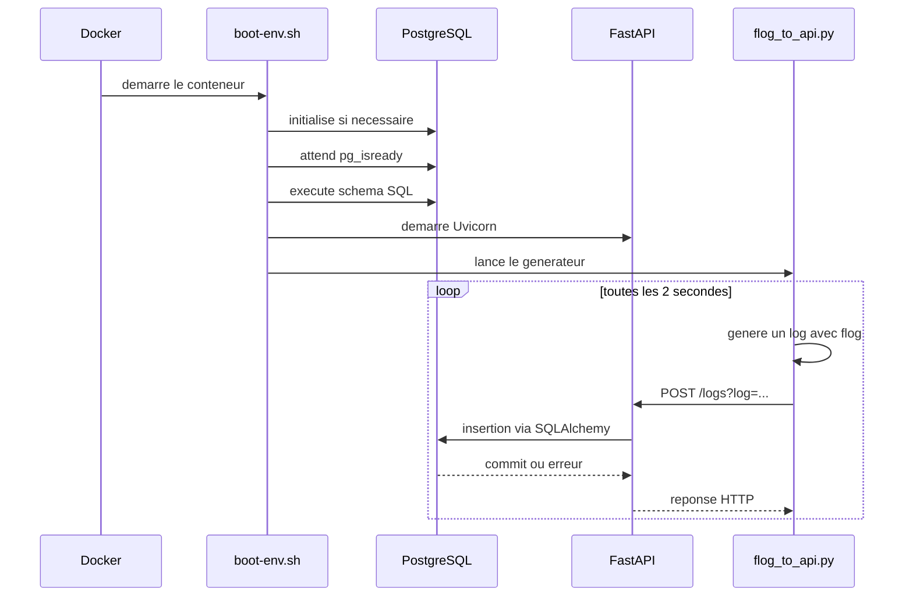

# Début du projet
# Explication technique du projet

## 1. Vue d'ensemble

Le projet met en place une petite API HTTP destinée a recevoir des logs et a les enregistrer dans PostgreSQL.

L'ensemble est lance dans un conteneur Docker unique qui contient :

- PostgreSQL, utilise comme base de donnees ;
- une API FastAPI, exposee sur le port `8000` ;
- SQLAlchemy, utilise pour communiquer avec PostgreSQL depuis Python ;
- `flog`, un generateur de logs installe depuis Go ;
- un script Python qui genere un log avec `flog` puis l'envoie a l'API toutes les deux secondes.

Le projet est donc compose de deux flux principaux :

1. le flux de demarrage du conteneur ;
2. le flux de generation, d'envoi et d'enregistrement des logs.

## 2. Organisation des fichiers

```text
docker-app/
├── Dockerfile              Construction de l'image Docker
├── compose.yaml            Lancement du service et exposition du port
├── boot-env.sh             Initialisation et demarrage des services
├── shema.sql               Creation de la table PostgreSQL
├── src/
│   ├── database.py         Connexion SQLAlchemy a PostgreSQL
│   ├── model.py            Modele ORM de la table logs_api
│   └── main.py             Application et routes FastAPI
└── src_flog/
    └── flog_to_api.py      Generation et envoi periodique de logs
```

## 3. Demarrage avec Docker

### 3.1 `compose.yaml`

Le fichier Compose definit un seul service, appele `app` :

- l'image est construite a partir du `Dockerfile` present dans `docker-app/` ;
- le port `8000` du conteneur est publie sur le port `8000` de la machine hote.

La base PostgreSQL n'est pas un service Compose separe. Elle tourne dans le meme conteneur que l'API.

### 3.2 `Dockerfile`

L'image part d'Alpine Linux. Le Dockerfile installe :

- PostgreSQL et ses outils ;
- Python, FastAPI, SQLAlchemy et psycopg ;
- Go, necessaire pour compiler `flog`.

Les sources Python sont copiees dans `/home/postgres/app`. Le script de demarrage et le schema SQL sont copies a la racine du conteneur.

Le processus du conteneur est lance avec l'utilisateur systeme `postgres`, ce qui permet a PostgreSQL d'utiliser correctement son repertoire de donnees.

### 3.3 `boot-env.sh`

Le script effectue les operations suivantes :

1. Il definit le repertoire de donnees PostgreSQL : `/var/lib/postgresql/data`.
2. Il teste la presence de `PG_VERSION` pour savoir si PostgreSQL a deja ete initialise.
3. Lors du premier demarrage, il execute `initdb`.
4. Il ajoute une regle `trust` dans `pg_hba.conf`, ce qui autorise les connexions sans mot de passe depuis les adresses indiquees.
5. Il configure PostgreSQL pour ecouter sur toutes les interfaces reseau avec `listen_addresses = '*'`.
6. Il demarre PostgreSQL en arriere-plan.
7. Il attend que PostgreSQL soit pret avec `pg_isready`.
8. Il execute `shema.sql` avec `psql`.
9. Il demarre Uvicorn et l'application FastAPI.
10. Il lance ensuite le programme `flog_to_api.py`, qui reste actif en boucle.

Le demarrage de l'API et du generateur de logs se fait donc dans le meme conteneur. Le processus qui reste au premier plan est le script Python `flog_to_api.py`.

## 4. Base de donnees

### 4.1 Schema SQL

Le fichier `shema.sql` cree la table `logs_API` si elle n'existe pas deja :

- `id_log` : identifiant numerique genere automatiquement et cle primaire ;
- `description` : contenu du log, obligatoire ;
- `ia_Response` : champ texte prevu pour une reponse d'intelligence artificielle, mais non utilise par le code actuel ;
- `date_creation` : date de creation, initialisee par PostgreSQL avec `CURRENT_TIMESTAMP`.

La commande `CREATE TABLE IF NOT EXISTS` rend la reexecution du schema idempotente : elle ne recree pas la table si elle existe deja.

### 4.2 `database.py`

Ce module configure SQLAlchemy.

```python
DATABASE_URL = "postgresql+psycopg://postgres@localhost:5433/postgres"
```

Cette URL indique :

- le dialecte PostgreSQL ;
- le pilote `psycopg` ;
- l'utilisateur `postgres` ;
- l'hote `localhost` ;
- le port `5433` ;
- la base `postgres`.

`create_engine` construit le moteur de connexion. `SessionLocal` est une fabrique de sessions SQLAlchemy liee a ce moteur. Une session represente une unite de travail avec la base : on ajoute des objets, on valide avec `commit`, ou on annule avec `rollback`.

`Base` est la classe declarative utilisee par les modeles ORM.

### 4.3 `model.py`

La classe `Logs_API` represente la table `logs_api` pour SQLAlchemy :

- `id_log` correspond a la cle primaire ;
- `description` correspond au texte du log ;
- `index=True` demande un index SQL sur les colonnes concernees.

Le constructeur accepte une description et la stocke dans l'objet Python. SQLAlchemy transforme ensuite cet objet en instruction SQL lors du `commit`.

Le nom de table SQL est `logs_api`, tandis que le schema cree `logs_API`. PostgreSQL convertit les identifiants non entoures de guillemets en minuscules, donc ces deux formes designent la meme table.

## 5. API FastAPI

### 5.1 Initialisation

Dans `main.py`, l'application est creee avec `FastAPI`. Uvicorn charge cette instance avec la commande `uvicorn main:app`.

FastAPI genere aussi automatiquement une documentation OpenAPI, habituellement accessible sur `/docs`, ainsi qu'une autre interface sur `/redoc`.

### 5.2 `GET /users/{username}`

Cette route prend `username` dans le chemin URL et renvoie un objet JSON :

```json
{"message": "Hello alice"}
```

Elle sert actuellement de route de demonstration. Elle ne consulte pas la base de donnees.

### 5.3 `POST /logs`

Cette route attend un parametre de requete appele `description` :

```text
POST /logs?description=un-message
```

FastAPI convertit la valeur recue en argument Python. Le traitement est ensuite :

1. creation d'une session avec `SessionLocal()` ;
2. creation d'un objet `Logs_API` ;
3. ajout de l'objet a la session avec `db.add(log)` ;
4. validation de la transaction avec `db.commit()` ;
5. fermeture de la session dans `finally` ;
6. retour du texte `Log created.` avec le statut HTTP `201 Created`.

Si une exception se produit pendant l'ajout ou la validation, `db.rollback()` annule la transaction, puis l'exception est relancee. FastAPI transforme alors cette exception en erreur HTTP selon son traitement global.

## 6. Generation automatique des logs

Le fichier `src_flog/flog_to_api.py` execute une boucle infinie :

1. `subprocess.check_output` lance `flog` et demande un seul log au format RFC 3164 ;
2. le resultat est nettoye avec `strip()` ;
3. `urlencode` encode la valeur pour une URL ;
4. `Request` prepare une requete `POST` vers `http://127.0.0.1:8000/logs` ;
5. `urlopen` envoie la requete ;
6. le programme attend deux secondes avec `time.sleep(2)`.

Le parametre ajoute a l'URL par ce script est actuellement `log` :

```text
POST /logs?log=...
```

Cependant, la route FastAPI declare un argument `description`. En l'etat, les appels automatiques du script ne correspondent donc pas au contrat de l'endpoint et FastAPI devrait repondre avec une erreur de validation `422 Unprocessable Entity`, car `description` est absent.

Cette incoherence est decrite ici uniquement ; aucun fichier de code n'a ete modifie.

## 7. Flux complet



## 8. Points techniques importants

### Connexion et ports

Le port `5433` est code en dur dans `DATABASE_URL`, alors que le port PostgreSQL par defaut est souvent `5432`. Le fonctionnement depend donc de la configuration effective du serveur dans l'image et de l'environnement d'execution.

L'API ecoute sur `0.0.0.0:8000`, ce qui la rend accessible depuis l'exterieur du conteneur via le mapping Compose `8000:8000`.

### Gestion des transactions

Le couple `commit` / `rollback` protege l'insertion : une erreur ne laisse pas une transaction partiellement valide. La fermeture dans `finally` evite de garder une connexion ouverte apres la requete.

### Configuration de developpement

Uvicorn est demarre avec `--reload`, option principalement destinee au developpement. Elle surveille les fichiers et redemarre l'application lorsqu'ils changent.

### Securite

La ligne `host all all 0.0.0.0/0 trust` autorise sans authentification les connexions PostgreSQL depuis n'importe quelle adresse IPv4. C'est une configuration tres permissive, adaptee au test mais risquee pour une exposition reseau reelle.

De la meme maniere, `listen_addresses = '*'` rend PostgreSQL disponible sur toutes les interfaces du conteneur. L'API ne contient pas non plus de mecanisme d'authentification.

### Robustesse

Le script `flog_to_api.py` ne gere pas les erreurs HTTP ou les interruptions reseau. Une exception de `urlopen` termine la boucle. Le script ne gere pas non plus l'arret propre du processus.

## 9. Resume du fonctionnement actuel

En theorie, le projet est une chaine :

```text
flog -> script Python -> API FastAPI -> SQLAlchemy -> PostgreSQL
```

La structure de cette chaine est fonctionnelle et simple a suivre. Le principal probleme de fonctionnement visible dans le code est le nom different du parametre entre le producteur (`log`) et l'API (`description`). Le schema contient aussi des champs en preparation, notamment `ia_Response`, qui ne sont pas encore exploites par l'application.